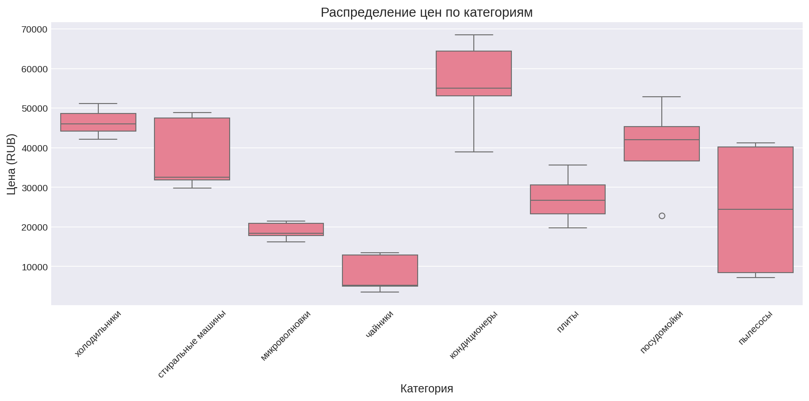
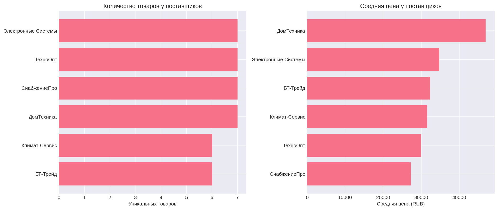
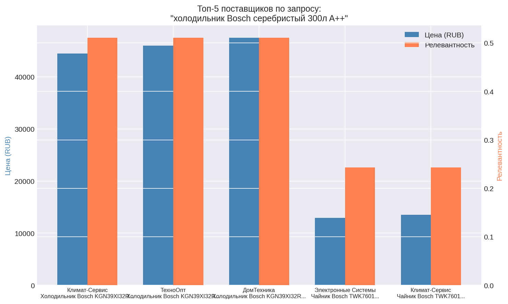
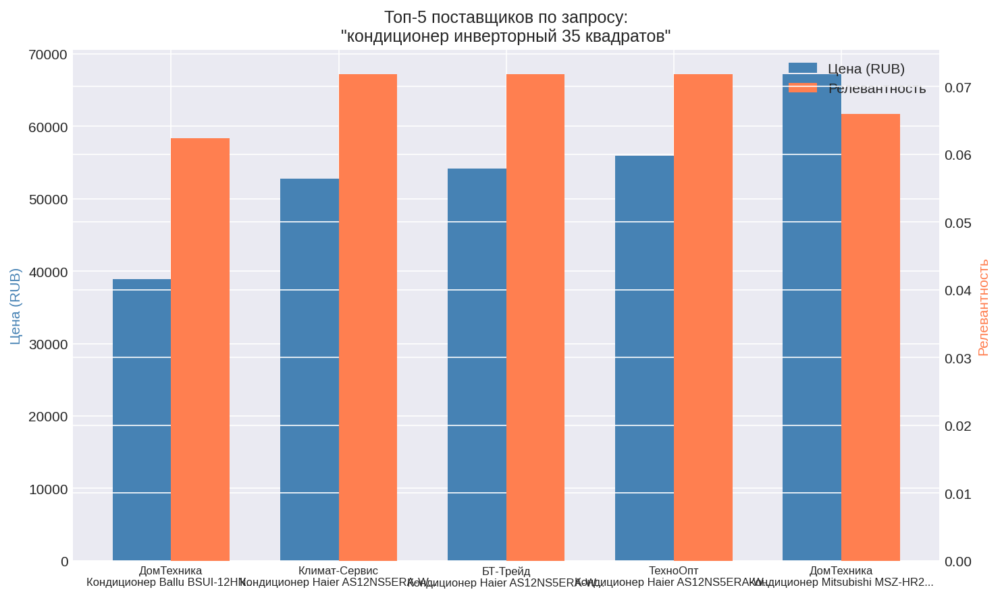
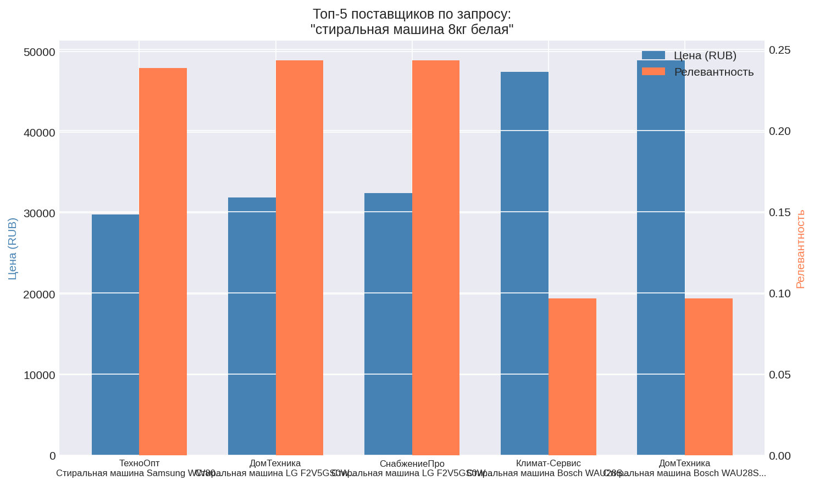
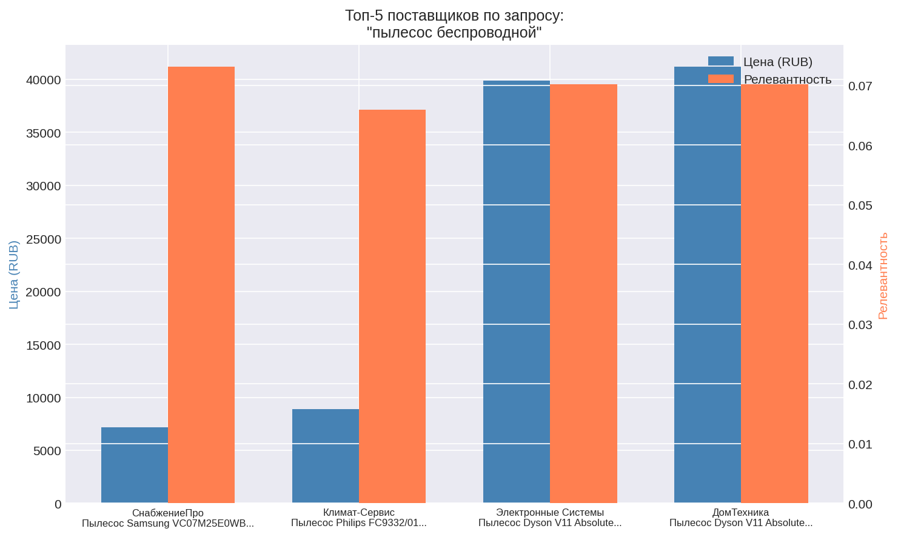
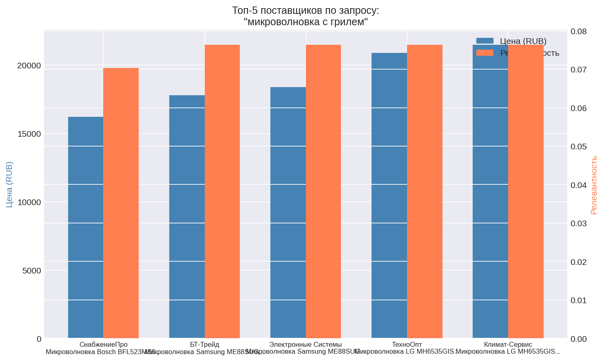

# Supplier Matcher — AI агент подбора поставщиков

Сервис для автоматического парсинга коммерческих предложений и семантического поиска поставщиков.

**Репозиторий:** https://github.com/SKZHPRVT/supplier_matcher

---

## 🚀 Быстрый старт

### Установка

```bash
git clone https://github.com/SKZHPRVT/supplier_matcher.git
cd supplier_matcher
python3 -m venv venv
source venv/bin/activate
pip install -r requirements.txt
```

### Запуск

```bash
python3 main.py
```

### Тесты

```bash
pytest tests/ -v
```

**Результат: 40 тестов passed** ✅

---

## 🛠️ Технологии

| Технология | Обоснование |
|------------|-------------|
| Python 3.12 | Стабильный язык с богатой DS-экосистемой |
| pandas | Стандарт для табличных данных |
| scikit-learn | TF-IDF векторизация |
| matplotlib/seaborn | Визуализация |
| pytest | 40 unit-тестов |

---

## 📊 Скриншоты графиков

### Распределение цен по категориям


### Сравнение поставщиков


### Топ-5: холодильник Bosch


### Топ-5: кондиционер инверторный


### Топ-5: стиральная машина


### Топ-5: пылесос беспроводной


### Топ-5: микроволновка с грилем


---

## 💼 Мотивация участия в проекте

### 1. Почему мне интересен этот проект?
Проект находится на стыке NLP, информационного поиска и реальной бизнес-оптимизации. Это конкретный инструмент, который экономит часы ручной работы специалистов по закупкам.

### 2. Как я вижу свою роль в команде?
Готов взять на себя разработку ML-пайплайна — от парсинга данных до ранжирования и оценки качества.

### 3. Сколько времени готов уделять?
- **15–20 часов в неделю**
- **Период: 3–6 месяцев**
- Готов начать сразу после одобрения

---

## 📬 Контакты
- GitHub: [SKZHPRVT](https://github.com/SKZHPRVT)
